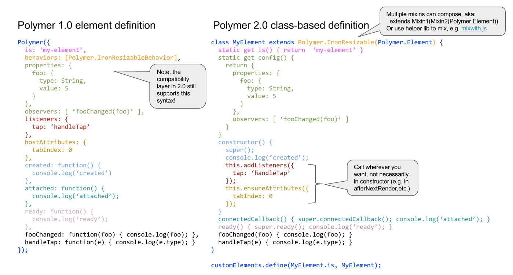

# Polymer 2.0 (pre-release)

This branch contains a preview of the Polymer 2.0 library.  The codebase is under active development, features may not be fully implemented, and APIs may change prior to the final 2.0 release. 

🚧 Note: Some tests currently fail on non-Chrome browsers; these will be addressed soon, but in the short term Chrome Canary is your best bet. 🚧

## Polymer 2.0 Goals

1. **Take advantage of native "v1" Web Components implementations across browsers.**

   The primary goal of the Polymer 2.0 release is to take advantage of native, cross-browser support for Web Components.

   Polymer 1.x is built on top of the so-called "v0" Web Components specs, which are supported natively only in Google Chrome; using Polymer in other browsers has always required the use of polyfills.

   Beginning this fall, multiple browsers will be shipping native implementations of the new "v1" specs for Shadow DOM and Custom Elements, yielding better web components performance and reducing the need for polyfills.

   Polymer 2.0 features full support for the v1 specs, taking advantage of native browser implementations where they are available and depending on updated v1 polyfills from [webcomponentsjs](https://github.com/webcomponents/webcomponentsjs) where necessary.

   Polymer 2.0 also embraces the new ES-class-based mechanism for defining custom elements, bringing idiomatic Polymer style closer to "vanilla" custom element authoring.

1. **Provide a smooth migration path from Polymer 1.x.**

   Our second major goal is to provide as easy a transition as possible for developers who have built elements and apps with Polymer 1.x, making Polymer 2.0 a sturdy bridge to the future.

   To upgrade, you will need to make some changes to your 1.x-based elements and apps. These changes are necessitated by both the v0-to-v1 spec transition and a handful of key improvements in Polymer itself (see our remaining goals, below).

   However, we've taken care to limit the number of changes that are strictly required and to ease the process of upgrading:

   * Polymer 2.0 introduces a new [ES6 class-based syntax](#20-es6-class-based-syntax), but we've provided a [lightweight compatibility layer](#10-compatibility-layer) allowing you to upgrade your 1.x code with minimal modifications. Depending on your needs, you can either take advantage of the compatibility layer or jump straight to idiomatic 2.0 style.

   * Before releasing Polymer 2.0, we'll also provide an upgrade tool to automate as many of the changes (both required and recommended) as possible.

   * Finally, we're working on guidelines for building and testing "hybrid" elements that will run in both Polymer 1.x and Polymer 2.0. We plan to ship hybrid versions of all of the elements that we provide, easing the transition for developers who use them. Third-party element providers may also choose to ship hybrid elements.

   * If you have an especially large app or constraints that don't allow for an all-at-once upgrade, you can also use hybrid elements to migrate your app from 1.x to 2.0 in piecewise fashion: update your elements to hybrid form, individually or in batches, while running against Polymer 1.x; then cut over to Polymer 2.0 when all of your elements have been updated.

1. **Eliminate leaky abstractions.**

   Seamless interoperability is one of Web Components' major selling points. Generally speaking, web components "just work" anywhere you use HTML elements. To use them, you need only be aware of their public attributes, properties, methods and events; you don't need to know anything about their inner workings. This means you can easily mix standard HTML elements, third-party elements and elements you've defined yourself.

   Unfortunately, there are a couple of cases in Polymer 1.x (the `Polymer.dom` API and the `set`/`notifyPath` API) where implementation details of Polymer-based elements leak out, requiring users of the elements to interact with them in non-standard ways. These "leaks" were by design – compromises we chose to make in the interest of performance – but in hindsight we aren't happy with the tradeoff.

   In Polymer 2.0 we've found ways to eliminate these leaky abstractions without unduly compromising performance, which means that your Polymer 2.x-based elements will be indistinguishable from "vanilla" elements from a consumer's point of view (unless you leak implementation details of your own).

1. **Make targeted improvements to the Polymer data system.**

   Based on developer feedback and observations of Polymer apps in the wild, we've also made some key improvements to Polymer's data system. These changes are designed to make it easier to reason about and debug the propagation of data through and between elements:

   * Changes are now batched, and the effects of those changes are run in well-defined order (compute, notify, propagate, observe).

   * We ensure that multi-property observers run exactly once per turn for any set of changes to dependencies (removing the [multi-property undefined rule](https://www.polymer-project.org/1.0/docs/devguide/observers#multi-property-observers)).

   * To improve compatibility with top-down data-flow approaches (e.g. Flux), we no longer dirty-check properties whose values are objects or arrays.

1. **Improve factoring of Polymer and the polyfills**

   We've done some refactoring of Polymer and the webcomponentsjs polyfills to improve efficiency, utility and flexibility:

   * The "Shady DOM" shim that was part of Polymer 1.x has been factored out of Polymer and added to the webcomponentsjs polyfills, along with the related shim for CSS Custom Properties. (As noted above, the Shady DOM shim no longer exposes an alternative API but instead patches the native DOM API.)

   * Polymer itself has been internally factored into several loosely coupled libraries.

     * The new `Polymer.Element` class extends from the native `HTMLElement` and mixes in functionality from these libraries.

     * The idiomatic way of using Polymer 2.0 (assuming you're not using the 1.x compatibility layer) is to define your own custom elements that subclass `Polymer.Element`, using standard ES class definition syntax.

     * If you're interested in using pieces of Polymer's functionality in _a la carte_ fashion, you can try defining your own base element class, utilizing a subset of the libraries. For now, this use case should be considered experimental, as the factoring of libraries is subject to change and is not part of the official Polymer 2.0 API.

## 1.0 Compatibility Layer
Polymer 2.0 retains the existing `polymer/polymer.html` import that current Polymer 1.0 users can continue to import, which strives to provide a very minimally-breaking change for code written to the Polymer 1.0 API.  For the most part, existing users upgrading to Polymer 2.0 will only need to adapt existing code to be compliant with the V1 Shadow DOM API related to content distribution and styling, as well as minor breaking changes introduced due to changes in the V1 Custom Elements spec and data-layer improvements listed [below](#breaking-changes).

## 2.0 ES6 Class-based Syntax
With the widespread adoption of ES6 in browsers, as well as the requirement that V1 Custom Elements be defined as ES6 class extsions of `HTMLElement`, Polymer 2.0 shifts its primary API for defining new elements to an ES6 class-centric syntax.  Using this syntax, users will extend `Polymer.Element` (a subclass of `HTMLElement`), which provides meta-programming for most of the same features of Polymer 1.0 based on static configuration data supplied on the class definition.

Basic syntax looks like this:

```
<!-- Load the Polymer.Element base class -->
<link rel="import" href="bower_components/polymer/polymer-element.html">
```

```
// Extend Polymer.Element base class
class MyElement extends Polymer.Element {
  static get is() { return 'my-element'; }
  static get config() {
   return { /* properties, observers meta data */ }
  }
  constructor() {
    super();
    ...
  }
  connectedCallback() {
    super.connectedCallback();
    ...
  }
  ...
}

// Register custom element definition using standard platform API
customElements.define(MyElement.is, MyElement);
```

Users can then leverage native subclassing support provided by ES6 to extend and customize existing elements defined using ES6 syntax:

```
// Subclass existing element
class MyElementSubclass extends MyElement {
  static get is() { return 'my-element-subclass'; }
  static get config() { ... }
  constructor() {
    super();
    ...
  }
  ...
}

// Register custom element definition using standard platform API
customElements.define(MyElementSubclass, MyElementSubclass);
```

Below are the general steps for defining a custom element using this new syntax:

* Extend from `Polymer.Element`. This class provides the minimal surface area to integrate with 2.0's data binding system. It provides only standard custom element lifecycle with the exception of `ready`. (You can extend from `Polymer.CompatElement` to get all of the Polymer 1.0 element api, but since most of this api was rarely used, this should not often be needed.)
* Implement "behaviors" as [mixins that return class expressions](http://justinfagnani.com/2015/12/21/real-mixins-with-javascript-classes/)
* Property metadata (`properties`) and multi-property/wildcard observers (`observers`) should be put on the class as a static in a property called `config`
* Element's `is` property should be defined as a static on the class
* Implement a static `template` getter to provide a template to stamp inside the element. By default the first `<template>` found in a `<dom-module>` with an `id` matching the element's `is` property is used.
* `listeners` and `hostAttributes` have been removed from element metadata; they can be installed how and when needed but for convenience `ensureAttribute` is available. The ability to reference other elements in the listeners object has been removed (e.g. `'foo.tap': 'myHandler'`)

Note that `Polymer.Element` provides a cleaner base class void of a lot of sugared utility API that present on elements defined with `Polymer()`, such as `fire`, `transform`, etc.  With web platform surface area becoming far more stable across browsers, we intend to hew towards sugaring less and embracing the raw platform API more.  So when using `Polymer.Element`, instead of using the legacy `this.fire('some-event')` API, simply use the equivalent platform API's such as `this.dispatchEvent(new CustomEvent('some-event'), {bubbles: true})`.  #usetheplatorm

See below for a visual guide on migrating Polymer 1.0's declarative syntax to the ES6 class syntax in Polymer 2.0:

<a href="">

</a>

## Polyfills

Polymer 2.0 has been developed alongside and tested with a new suite of V1-spec compatible polyfills for Custom Elements and Shadow DOM.   Polymer 2.0 can currently be tested by loading the `v1-polymer-edits` branch of [`webcomponentsjs/webcomponents-lite.js`](https://github.com/webcomponents/webcomponentsjs/tree/v1-polymer-edits).  The polyfills are still under active development and are not fully ready for use in other browsers or for production.

## Breaking Changes
Below is a list of intentional breaking changes made in Polymer 2.0, along with their rationale/justification and migration guidance.  If you find changes that broke existing code not documented here, please [file an issue](https://github.com/Polymer/polymer/issues/new) and we'll investigate to determine whether they are expected/intentional or not.


### Polymer.dom
On browsers that lack native V1 Shadow DOM support, Polymer 2.0 is designed to be used with the new [V1 Shady DOM shim](https://github.com/webcomponents/shadydom), which patches native DOM API as necessary to be mostly equivalent to native Shadow DOM.  This removes the requirement to use the `Polymer.dom` API when interacting with the DOM.  `Polymer.dom` can be eliminated for elements targeting Polymer 2.0, in favor of the native DOM API's.

Note that `Polymer.dom` is still provided in the `polymer.html` backward-compatibility layer which simply facades the native API, but usage of it in 2.0 can be removed.

### V1 Shadow DOM
Polymer 2.0 elements will stamp their templates into shadow roots created using V1's `attachShadow({mode: 'open'})` by default.  As such, user code related to scoped styling, distribution, and events must be adapted to native V1 API.  For a great writeup on all Shadow DOM V1 spec changes, [see this writeup](http://hayato.io/2016/shadowdomv1/).  Required changes for V1 are summarized below:

#### Distribution
* `<content>` insertion points must be changed to `<slot>`
* Insertion points that selected content via `<content select="...">` must be changed to named slots: `<slot name="...">`
* Selection of distributed content into named slots must use `slot="..."` rather than tag/class/attributes selected by `<content>`
* Re-distributing content by placing a `<slot>` into an element that itself has named slots requires placing a `name` attribute on the `<slot>` to indicate what content _it_ selects from its host children, and placing a `slot` attribute to indicate where its selected content should be slotted into its parent

#### Scoped styling

* `::content` CSS pseudo-selectors must be changed to `::slotted`, and may only target immediate children and use no descendant selectors
* `:host-context()` pseudo-selectors have been removed. These were primarily useful for writing bidi rules (e.g. `:host-context([dir=rtl])`); these should be replaced with the [new `:dir(rtl)` selector](https://developer.mozilla.org/en-US/docs/Web/CSS/:dir), which we plan to polyfill in the [styling shim](https://github.com/webcomponents/shadycss) soon
* The previously deprecated `/deep/` and `::shadow` selectors have been completely removed from V1 native support and must not be used (use [CSS custom properties](https://www.polymer-project.org/1.0/docs/devguide/styling#custom-css-properties) to customize styling instead)

#### Scoped events

* Code using `Polymer.dom(event).localTarget` should change to the V1 standard API `event.target`
* Code using `Polymer.dom(event).path` (aka V0 `event.path`) should change to the V1 standard API `event.composedPath()`
* Code using `Polymer.dom(event).rootTarget` (aka V0 `event.path[0]`)  should change to the V1 standard API `event.composedPath()[0]`

### V1 Custom Elements
Polymer 2.0 elements will target the V1 Custom Elements API, which primarily changes the "created" step to actually invoke the `class` constructor, imposes new restrictions on what can be done in the `constructor` (previously `createdCallback`), and introduces different callback names.

* Changes to callback names:
  * When using `Polymer({...})` from the compatibility layer, all callbacks should use legacy Polymer API names (`created`, `attached`, `detached`, `attributeChanged`)
  * When extending from `Polymer.Element`, users should override the V1 standard callback names and call `super()`:
    * `connected` changes to `constructor`
    * `attached` changes to `connectedCallback`
    * `detached` changes to `disconnectedCallback`
    * `attributeChanged` changes to `attributeChangedCallback`
* The V1 Custom Elements spec forbids reading attributes, children, or parent information from the DOM API in the `constructor` (or `created` when using the legacy API).  Likewise, attributes and children may not be added in the `constructor`.  Any such work must be deferred (e.g. until `connectedCallback` or microtask/`setTimeout`/`requestAnimationFrame`).
* Polymer will no longer produce type-extension elements (aka `is="..."`). Although they are still included in the V1 Custom Elements [spec](https://html.spec.whatwg.org/#custom-elements-customized-builtin-example) and scheduled for implementation in Chrome, because Apple [has stated](https://github.com/w3c/webcomponents/issues/509#issuecomment-233419167) it will not implement `is`, we will not be encouraging its use to avoid indefinite reliance on the Custom Elements polyfill. Instead, a wrapper custom element can surround a native element, e.g. `<a is="my-anchor">...</a>` could become `<my-anchor><a>...</a></my-anchor>`. Users will need to change existing `is` elements where necessary.
* All template type extensions provided by Polymer have now been changed to standard custom elements that take a `<template>` in their light dom,  e.g.

  ```
  <template is="dom-repeat" items="{{items}}">...</template>
  ```

  should change to

  ```
  <dom-repeat items="{{items}}">
      <template>...</template>
  </dom-repeat>
  ```

  For the time being, `Polymer()` will automatically wrap template extensions used in Polymer element templates during template processing for backward-compatibility, although we may decide to remove this auto-wrapping in the future.  Templates used in the main document must be manually wrapped.
* The `custom-style` element has also been changed to a standard custom element that must wrap a style element. In addition, the style element must contain a `type="custom-style"` attribute (so that it does not parse),  e.g.

  ```
  <style is="custom-style">...</style>
  ```

   should change to

   ```
   <custom-style>
     <style type="custom-style">...</style>
   </custom-style>
   ```

### CSS Custom Property Shim
Polymer 2.0 will continue to use a [shim](https://github.com/webcomponents/shadycss) to provide limited [CSS Custom Properties](#https://www.polymer-project.org/1.0/docs/devguide/styling#custom-css-properties) support on browsers that do not yet natively support custom properties, to allow an element to expose a custom styling API.  The following changes have been made in the shim that Polymer 2.0 will use:

* The shim will now always use native CSS Custom Properties by default on browsers that implement them (this was opt-in in 1.0).  The shim will perform a one-time transformation of stylesheets containing [CSS Custom Property mixins](https://www.polymer-project.org/1.0/docs/devguide/styling#custom-css-mixins) to leverage individual native CSS properties where possible for better performance.  This introduces [some limitations](https://github.com/webcomponents/shadycss#custom-properties-and-apply) to be aware of.
* The following invalid styling syntax was previously accepted by the 1.0 custom property shim.  In order to support native CSS Custom Properties, rules should be correct to use only natively valid syntax:
  * `:root {}`
    * Should be `:host > * {}` (in a shadow root)
    * Should be `html {}` (in main document)
    * Thus, cannot share old `:root` styles for use in both main document and shadow root
  * `var(--a, --b)`
    * Should be `var(--a, var(--b))`
  * `@apply(--foo)`
    * Should be `@apply --foo;`
* `element.customStyle` as an object that can be assigned to has been removed; use `element.updateStyles({...})` instead.
* `<style>` inside of a `<dom-module>`, but outside of `<template>` is no longer supported
* Imperativly created custom-styles (e.g. `document.createElement('style', 'custom-style')`) are no longer supported.

### Data layer
* An element's template is not stamped & data system not initialized (observers, bindings, etc.) until the element has been connected to the main document.  This is a direct result of the V1 changes that prevent reading attributes in the constructor.
* Re-setting an object or array no longer ditry checks, meaning you can make deep changes to an object/array and just re-set it, without needing to use `set`/`notifyPath`.  Although the `set` API remains and will often be the more efficient way to make changes, this change removes users of Polymer elements from needing to use this API, making it more compatible with alternate data-binding and state management libraries.
* Propagation of data through the binding system is now batched, such that multi-property computing functions and observers run once with a set of coherent changes.  Single property accessors still propagate data synchronously, although there is a new `setProperties({...})` API on Polymer elements that can be used to propagate multiple values as a coherent set.
* Multi-property observers and computed methods are now called once at initialization if any arguments are defined (and will see `undefined` for any undefined arguments)
* Inline computed annotations run once unconditionally at initialization, regardless if any arguments are defined (and will see `undefined` for undefined arguments)
* Setting/changing any function used in inline template annotations will cause the binding to re-compute its value using the new function and current property values
‘notify’ events not fired when value changes as result of binding from host
* In order for a property to be deserialized from its attribute, it must be declared in the `properties` metadata object

### Removed API
* `Polymer.instanceof` and `Polymer.isInstance`: no longer needed, use
`instanceof` and `instanceof Polymer.Element` instead.
* `dom-module`: Removed ability to use `is` and `name` attribute to
configure the module name. The only supported declarative way set the module
id is to use `id`.
* `element.getPropertyInfo`: This api returned unexpected information some of the time and was rarely used.
* `element.getNativePrototype`: Removed because it is no longer needed for internal code and was unused by users.
* `element.beforeRegister`: This was originally added for metadata compatibility with ES6 classes. We now prefer users create ES6 classes by extending `Polymer.Element`, specifying metadata in the static `config` property. For legacy use via `Polymer({...})`, dynamic effects may now be added using the `registered` lifecycle method.
* `element.attributeFollows`: Removed due to disuse.
* `element.classFollows`: Removed due to disuse.
* `listeners`: Removed ability to use `id.event` to add listeners to elements in local dom. Use declarative template event handlers instead.
* Methods starting with `_` are not guaranteed to exist (most have been removed)

### Other
* Attached: no longer deferred until first render time. Instead when measurement is needed use... API TBD.
* `lazyRegister` option removed and is now “on” by default
* Experimental: `listeners` and `hostAttributes` are deferred until "afterNextRender", since the majority uses of these should not be initial paint-blocking.  Please help identify use cases where paint-blocking host attributes/listeners are useful/needed.
* Requst to early-users: We would really like to remove the `ready` callback, since its use is generally anti-pattern-ish, and it's hard to document when a "one-shot callback that runs after all local dom & observers have flushed" should actually be used, as opposed to running said code in an observer.  In exploring alacarte, please try to avoid `ready` and help identify use cases where it is useful/needed.
* Polymer 2.0 uses ES2015 syntax, and can be run without transpilation in current Chrome, Safari Technology Preview, Firefox, and Edge.  Transpilation is required to run in IE11 and Safari 9.  We will be releasing tooling for development and production time to support this need in the future.

## Not yet implemented
* Some utility functions are not yet implemented
    * A number of utility functions that were previously on the Polymer 1.0 element prototype are not ported over yet.  These will warn with "not yet implemented" warnings.  In general, these can be avoided using standard DOM API.
* `<array-selector>` not yet implemented
* `Polymer.dom`: currently *most* of this is emulated, but some api's may be missing. Please file issues to determine if the missing behavior is an intended breaking change.
* `Polymer.dom.observeNodes`: we're likely going to provide a breaking replacement for this that's more in the spirit of ShadowDom V1.
